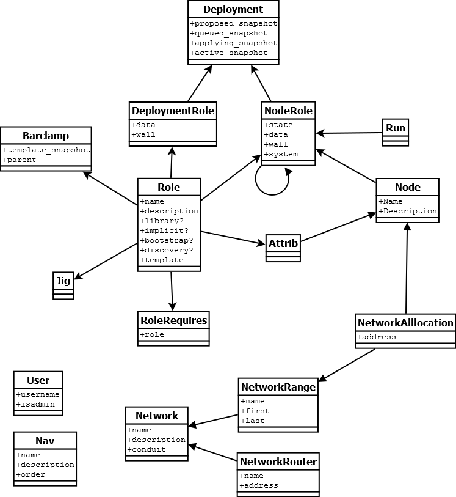

Experimental OpenCrowbar Model
^^^^^^^^^^^^^^^^^^^^^^^^^^^^^^

|OpenCrowbar Model (image)|

Required Overrides
^^^^^^^^^^^^^^^^^^

The OpenCrowbar system requires that you overide certain
models/controllers for it to work

The required overrides are:

-  Barclamp[Name]::Barclamp

The optional overrides are:

-  Barclamp[Name]::Attrib[SpecialFunction]

Overriding Barclamp.rb
^^^^^^^^^^^^^^^^^^^^^^

The superclass Barclamp.rb provides everything that you need to operate
OpenCrowbar for most functions. You can override it to create advanced
functionality.

create\_proposal
''''''''''''''''

Notes:

-  superclass calls create\_deployment

Use this to pre-populate nodes into a new proposal

is\_valid? deployment
'''''''''''''''''''''

Notes:

-  superclass returns true
-  called before deployment.commit

process\_inbound\_data
''''''''''''''''''''''

transition
''''''''''

This is a critical function, it determines which actions the barclamp
takes when it gets new information.

versions
''''''''

Defaults to 2.0

